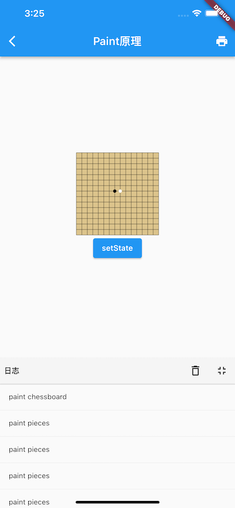

# 14.7 绘制（三）Layer 实例

本节通过优化之前“绘制棋盘示例“来像大家展示如何在自定义组件中使用Layer。

## 14.7.1 通过 Layer 实现绘制缓存

我们之前绘制棋盘示例是使用的CustomPaint组件，然后再painter的paint方法中同时实现了绘制棋盘和棋子，实际上这里可以有一个优化，因为棋盘是不会变化的，所以理想的方式就是当绘制区域不发生变化时，棋盘只需要绘制一次，当棋子发生变化时，每次只需要绘制棋子信息即可。

> 注意：在实际开发中，要实现上述功能还是优先使用Flutter建议的”Widget组合“的方式：比如棋盘和棋子分别绘制在两个Widget中，然后包上 RepaintBoundary 组件后把他们添加到 Stack中，这样做到分层渲染。不过，本节主要是为了说明Flutter自定义组件中如何使用Layer，所以我们采用自定义RenderObject的方式来实现。


1. 首先我们定义一个ChessWidget，因为它并非容器类组件，所以继承自 LeafRenderObjectWidget 。

   ```dart
   class ChessWidget extends LeafRenderObjectWidget {
     @override
     RenderObject createRenderObject(BuildContext context) {
       // 返回Render对象
       return RenderChess();
     }
     //...省略updateRenderObject函数实现
   }
   ```

   由于自定义的 RenderChess 对象不接受任何参数，所以我们可以在ChessWidget 中不用实现`updateRenderObject`方法。

2. 实现 RenderChess；我们先直接实现一个未缓存棋盘的原始版本，随后我们再一点点添加代码，直到把它改造成可以缓存棋盘的对象。

   ```dart
   class RenderChess extends RenderBox {
     @override
     void performLayout() {
       //确定ChessWidget的大小
       size = constraints.constrain(
         constraints.isTight ? Size.infinite : Size(150, 150),
       );
     }
   
     @override
     void paint(PaintingContext context, Offset offset) {
       Rect rect = offset & size;
       drawChessboard(canvas, rect); // 绘制棋盘
       drawPieces(context.canvas, rect);//绘制棋子
     }
   }
   ```

3. 接下来我们需要实现棋盘缓存，我们的思路是：

   - 创建一个 Layer 专门绘制棋盘，然后缓存。
   - 当重绘触发时，如果绘制区域发生了变化，则重新绘制棋盘并缓存；如果绘制区域未变，则直接使用之前的Layer

   为此，我们需要定义一个PictureLayer来缓存棋盘，然后添加一个 _checkIfChessboardNeedsUpdate 函数来实现上述逻辑：

   ```dart
   // 保存之前的棋盘大小
   Rect _rect = Rect.zero;
   PictureLayer _layer = PictureLayer()
   
   _checkIfChessboardNeedsUpdate(Rect rect) {
     // 如果绘制区域大小没发生变化，则无需重绘棋盘
     if (_rect == rect) return;
     
     // 绘制区域发生了变化，需要重新绘制并缓存棋盘
     _rect = rect;
     print("paint chessboard");
    
     // 新建一个PictureLayer，用于缓存棋盘的绘制结果，并添加到layer中
     ui.PictureRecorder recorder = ui.PictureRecorder();
     Canvas canvas = Canvas(recorder);
     drawChessboard(canvas, rect); //绘制棋盘
     // 将绘制产物保存在pictureLayer中
     _layer = PictureLayer(Rect.zero)..picture = recorder.endRecording();
   }
   
   @override
   void paint(PaintingContext context, Offset offset) {
     Rect rect = offset & size;
     //检查棋盘大小是否需要变化，如果变化，则需要重新绘制棋盘并缓存
     _checkIfChessboardNeedsUpdate(rect);
     //将缓存棋盘的layer添加到context中，每次重绘都要调用，原因下面会解释
     context.addLayer(_layer);
     //再画棋子
     print("paint pieces");
     drawPieces(context.canvas, rect);
   }
   ```

   具体的实现逻辑见注释，这里不再赘述，需要特别解释的是在 paint 方法中，每次重绘都需要调用 `context.addLayer(_layer)` 将棋盘layer添加到当前的Layer树中，通过上一节的介绍，我们知道，实际上是添加到了当前节点的第一个绘制边界节点的Layer中。可能会有读者疑惑，如果棋盘不变的话，添加一次不就行了，为什么每次重绘都要添加？实际上这个问题我们上一节已经解释过了，因为重绘是当前节点的第一个父级向下发起的，而每次重绘前，该节点都会先清空所有的孩子，代码见 `PaintingContext.repaintCompositedChild` 方法，所以我们需要每次重绘时都要添加一下。

   > 思考题：为什么父级绘制边界节点每次重绘前都要先清空其layer的所有孩子？

   OK，现在我们已经实现了棋盘缓存了，下面我们来验证一下。

4. 我们创建一个测试 Demo 来验证一下，我们创建一个 ChessWidget 和一个 ElevatedButton，因为ElevatedButton在点击时会执行水波动画，所以会发起一连串的重绘请求，而根据上一节的知识，我们知道ChessWidget 和 ElevatedButton 会在同一个Layer上绘制，所以 ElevatedButton 重绘也会导致ChessWidget 的重绘。另外我们在绘制棋子和棋盘时都加了日志，所以我们只需要点击 ElevatedButton，然后查看日志就能验证棋盘缓存是否生效。

   > 注意：在当前版本（3.0）的Flutter中，ElevatedButton 的实现中并没有添加 RepaintBoundary，所以它才会和ChessWidget 在同一个 Layer 上渲染，如果后续 Flutter SDK中给 ElevatedButton 添加了RepaintBoundary，则不能通过本例来验证。

   ```dart
   class PaintTest extends StatefulWidget {
     const PaintTest({Key? key}) : super(key: key);
   
     @override
     State<PaintTest> createState() => _PaintTestState();
   }
   
   class _PaintTestState extends State<PaintTest> {
     ByteData? byteData;
   
     @override
     Widget build(BuildContext context) {
       return Center(
         child: Column(
           mainAxisSize: MainAxisSize.min,
           children: [
             const ChessWidget(),
             ElevatedButton(
               onPressed: () {
                 setState(() => null);
               },
               child: Text("setState"),
             ),
           ],
         ),
       );
     }
   }
   ```
   
   点击按钮后:发现，棋盘、棋子都可以正常显示，如图14-16：
   
   
   
   同时日志面板输出了很多"paint pieces"，并没有"paint chessboard"，可见棋盘缓存生效了。

   好的，貌似我们预期的功能已经实现了，但是别高兴太早，上面的代码还有一个内存泄露的坑，我们在下面LayerHandle 部分介绍。

## 14.7.2 LayerHandle

上面 RenderChess 实现中，我们将棋盘绘制信息缓存到了 layer 中，因为 layer 中保存的绘制产物是需要调用dispose方法释放的，如果ChessWidget销毁时没有释放则会发生内存泄露，所以们需要在组件销毁时，手动释放一下，给RenderChess中添加如下代码：

```dart
@override
void dispose() {
  _layer.dispose();
  super.dispose();
}
```

上面的场景比较简单，实际上，在Flutter中一个layer可能会反复被添加到多个容器类Layer中，或从容器中移除，这样一来有些时候我们可能会搞不清楚一个layer是否还被使用，为了解决这个问题，Flutter中定义了一个LayerHandle 类来专门管理layer，内部是通过引用计数的方式来跟踪layer是否还有使用者，一旦没有使用者，会自动调用layer.dispose来释放资源。为了符合Flutter规范，强烈建议读者在需要使用layer的时候通过LayerHandle来管理它。现在我们来修改一下上面的代码，RenderChess中定义一个 layerHandle，然后将`_layer` 全部替换为 `layerHandle.layer`：

```dart
// 定义一个新的 layerHandle
final layerHandle = LayerHandle<PictureLayer>();
 
_checkIfChessboardNeedsUpdate(Rect rect) {
    ...
    layerHandle.layer = PictureLayer(Rect.zero)..picture = recorder.endRecording();
  }

  @override
  void paint(PaintingContext context, Offset offset) {
    ...
    //将缓存棋盘的layer添加到context中
    context.addLayer(layerHandle.layer!);
    ...
  }

  @override
  void dispose() {
    //layer通过引用计数的方式来跟踪自身是否还被layerHandle持有，
    //如果不被持有则会释放资源，所以我们必须手动置空，该set操作会
    //解除layerHandle对layer的持有。
    layerHandle.layer = null;
    super.dispose();
  }
```

OK，这样就很好了！不过先别急着庆祝，现在我们再来回想一下上一节介绍的内容，每一个 RenderObject 都有一个layer 属性，我们能否直接使用它来保存棋盘layer呢？下面我们看看 RenderObject 中关于 layer 的定义：

```dart
@protected
set layer(ContainerLayer? newLayer) {
  _layerHandle.layer = newLayer;
}

final LayerHandle<ContainerLayer> _layerHandle = LayerHandle<ContainerLayer>();
```

可以发现，我们RenderObject 中已经定义了一个 `_layerHandle`了，它会去管理 layer；同时 `layer` 是一个setter，会自动将新 layer 赋值到 `_layerHandle` 上，那么我们是否可以在 RenderChess 中直接使用父类定义好的 `_layerHandle`，这样的话我们就无需再自定义一个 layerHandle 了。读者可以先结合上一节的内容思考一分钟，然后我们再往下看。

答案是：取决于当前节点的 isRepaintBoundary 属性是否为 true（即当前节点是否为绘制边界节点） ，如果为 true 则不可以，如果不为 true，则可以。上一节中讲过，Flutter在执行 flushPaint 重绘时遇到绘制边界节点：

1. 先检查其 `layer` 是否为空，如果不为空，则会先清空该 `layer` 的孩子节点，然后会使用该 `layer` 创建一个 PaintingContext，传递给 paint 方法。
2. 如果其 `layer` 为空，会创建一个 OffsetLayer 给它。

如果我们要将棋盘layer保存到预定义的 `layer`变量中的话，得先创建一个ContainerLayer，然后将绘制棋盘的PictureLayer作为子节点添加到新创建的ContainerLayer中，然后赋值给  `layer`变量。这样一来：

1. 如果我们设置 RenderChess 的 isRepaintBoundary  为`true`，那么在每次重绘时，flutter 框架都会将 layer 子节点清空，这样的话，我们的棋盘Picturelayer就会被移除，接下来就会触发异常。
2. 如果 RenderChess 的 isRepaintBoundary  为 `false`（默认值），则在重绘过程中 flutter 框架不会使用到 `layer` 属性，这中情况没有问题。

虽然，本例中 RenderChess 的 isRepaintBoundary  为 `false`，直接使用 `layer`是可以的，但我不建议这么做，原因有二：

1. RenderObject 中的 layer 字段在 Flutter 框架中是专门为绘制流程而设计的，按照职责分离原则，我们也不应该去蹭它。即使现在能蹭成功，万一哪天Flutter的绘制流发生变化，比如也开始使用非绘制边界节点的layer字段，那么我们的代码将会出问题。
2. 如果要使用Layer，我们也需要先创建一个ContainerLayer，既然如此，我们还不如直接创建一个LayerHandle，这更方便。

现在考虑最后一个问题，在上面示例中，我们点击按钮后，虽然棋盘不会重绘了，但棋子还是会重绘，这并不合理，我们希望棋盘区域不受外界干扰，只有新的落子行为时（点击在棋盘区域）时再重绘棋子。相信看到着，解决方案就呼之欲出了，我们有两种选择：

1. RenderChess 的 isRepaintBoundary 返回 true；将当前节点变为一个绘制边界，这样 ChessWidget 就会和按钮分别在不同的 layer 上绘制，也就不会相互影响。
2. 在使用 ChessWidget 时，给它套一个RepaintBoundary组件，和1的原理差不多的，只不过这种方式是将ChessWidget的父节点（RepaintBoundary）变为了绘制边界（而不是自身），这样也会创建一个新的 layer 来隔离按钮的绘制。

具体应该选哪种应该根据情况而定，第二种方案会更灵活，但第一种方案的实际效果往往会比较好，因为如果我们封装的复杂自绘控件中没有设置 isRepaintBoundary 为 true，我们很难保证使用者在使用时会给我们的空间添加RepaintBoundary，所以这种细节还是对使用者屏蔽掉会比较好。
