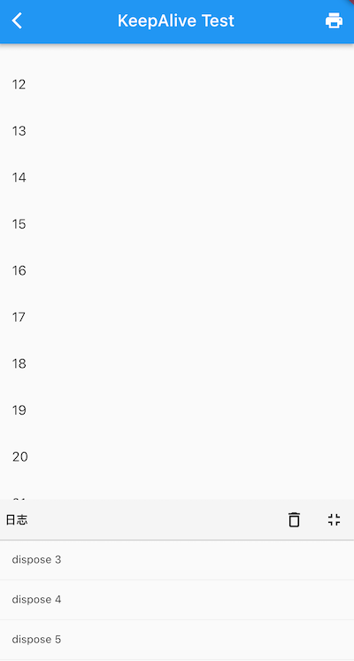

# 6.8 可滚动组件子项缓存 

本节将介绍可滚动组件中缓存指定子项的通用方案。

首先回想一下，在介绍 ListView 时，有一个`addAutomaticKeepAlives` 属性我们并没有介绍，如果`addAutomaticKeepAlives` 为 `true`，则 ListView 会为每一个列表项添加一个 AutomaticKeepAlive 父组件。虽然 PageView 的默认构造函数和 PageView.builder 构造函数中没有该参数，但它们最终都会生成一个 SliverChildDelegate 来负责列表项的按需加载，而在 SliverChildDelegate 中每当列表项构建完成后，SliverChildDelegate 都会为其添加一个 AutomaticKeepAlive 父组件。下面我们就先介绍一下 AutomaticKeepAlive 组件。

## 6.8.1 AutomaticKeepAlive

AutomaticKeepAlive 的组件的主要作用是将列表项的根 RenderObject 的 keepAlive **按需自动标记** 为 true 或 false。为了方便叙述，我们可以认为根 RenderObject 对应的组件就是列表项的根 Widget，代表整个列表项组件，同时我们将列表组件的 Viewport区域 + cacheExtent（预渲染区域）称为**加载区域** ：

1. 当 keepAlive 标记为 false 时，如果列表项滑出加载区域时，列表组件将会被销毁。
2. 当 keepAlive 标记为 true 时，当列表项滑出加载区域后，Viewport 会将列表组件缓存起来；当列表项进入加载区域时，Viewport 从先从缓存中查找是否已经缓存，如果有则直接复用，如果没有则重新创建列表项。

那么 AutomaticKeepAlive 什么时候会将列表项的 keepAlive 标记为 true 或 false 呢？答案是开发者说了算！Flutter 中实现了一套类似 C/S 的机制，AutomaticKeepAlive 就类似一个 Server，它的子组件可以是 Client，这样子组件想改变是否需要缓存的状态时就向 AutomaticKeepAlive 发一个通知消息（KeepAliveNotification），AutomaticKeepAlive 收到消息后会去更改 keepAlive 的状态，如果有必要同时做一些资源清理的工作（比如 keepAlive 从 true 变为 false 时，要释放缓存）。

我们基于上一节 PageView 示例，实现页面缓存，根据上面的描述实现思路就很简单了：让Page 页变成一个 AutomaticKeepAlive Client 即可。为了便于开发者实现，Flutter 提供了一个 AutomaticKeepAliveClientMixin ，我们只需要让 PageState 混入这个 mixin，且同时添加一些必要操作即可：

```dart
class _PageState extends State<Page> with AutomaticKeepAliveClientMixin {

  @override
  Widget build(BuildContext context) {
    super.build(context); // 必须调用
    return Center(child: Text("${widget.text}", textScaleFactor: 5));
  }

  @override
  bool get wantKeepAlive => true; // 是否需要缓存
}
```

代码很简单，我们只需要提供一个 `wantKeepAlive `，它会表示 AutomaticKeepAlive 是否需要缓存当前列表项；另外我们必须在 build 方法中调用一下 `super.build(context)`，该方法实现在 AutomaticKeepAliveClientMixin 中，功能就是根据当前 `wantKeepAlive` 的值给 AutomaticKeepAlive 发送消息，AutomaticKeepAlive 收到消息后就会开始工作，如图6-17所示：


现在我们重新运行一下示例，发现每个 Page 页只会 build 一次，缓存成功了。

需要注意，如果我们采用 PageView.custom 构建页面时没有给列表项包装 AutomaticKeepAlive 父组件，则上述方案不能正常工作，因为此时Client 发出消息后，找不到 Server，404 了，😀。

## 6.8.2 KeepAliveWrapper

虽然我们可以通过 AutomaticKeepAliveClientMixin 快速的实现页面缓存功能，但是通过混入的方式实现不是很优雅，因为必须更改 Page 的代码，而修改Page代码具有侵入性且不是很灵活，比如一个Page组件需要同时在列表中和列表外使用，为了在列表中缓存它，则我们必须实现两份。为了解决这个问题，笔者封装了一个 KeepAliveWrapper 组件，如果哪个列表项需要缓存，只需要使用 KeepAliveWrapper 包裹一下它即可。

```dart
@override
Widget build(BuildContext context) {
  var children = <Widget>[];
  for (int i = 0; i < 6; ++i) {
    //只需要用 KeepAliveWrapper 包装一下即可
    children.add(KeepAliveWrapper(child:Page( text: '$i'));
  }
  return PageView(children: children);
}
```

下面是 KeepAliveWrapper 的实现源码：

```dart
class KeepAliveWrapper extends StatefulWidget {
  const KeepAliveWrapper({
    Key? key,
    this.keepAlive = true,
    required this.child,
  }) : super(key: key);
  final bool keepAlive;
  final Widget child;

  @override
  _KeepAliveWrapperState createState() => _KeepAliveWrapperState();
}

class _KeepAliveWrapperState extends State<KeepAliveWrapper>
    with AutomaticKeepAliveClientMixin {
  @override
  Widget build(BuildContext context) {
    super.build(context);
    return widget.child;
  }

  @override
  void didUpdateWidget(covariant KeepAliveWrapper oldWidget) {
    if(oldWidget.keepAlive != widget.keepAlive) {
      // keepAlive 状态需要更新，实现在 AutomaticKeepAliveClientMixin 中
      updateKeepAlive();
    }
    super.didUpdateWidget(oldWidget);
  }

  @override
  bool get wantKeepAlive => widget.keepAlive;
}
```

下面我们再在 ListView 中测一下：

```dart
class KeepAliveTest extends StatelessWidget {
  const KeepAliveTest({Key? key}) : super(key: key);

  @override
  Widget build(BuildContext context) {
    return ListView.builder(itemBuilder: (_, index) {
      return KeepAliveWrapper(
        // 为 true 后会缓存所有的列表项，列表项将不会销毁。
        // 为 false 时，列表项滑出预加载区域后将会别销毁。
        // 使用时一定要注意是否必要，因为对所有列表项都缓存的会导致更多的内存消耗
        keepAlive: true,
        child: ListItem(index: index),
      );
    });
  }
}

class ListItem extends StatefulWidget {
  const ListItem({Key? key, required this.index}) : super(key: key);
  final int index;

  @override
  _ListItemState createState() => _ListItemState();
}

class _ListItemState extends State<ListItem> {
  @override
  Widget build(BuildContext context) {
    return ListTile(title: Text('${widget.index}'));
  }

  @override
  void dispose() {
    print('dispose ${widget.index}');
    super.dispose();
  }
}
```

因为每一个列表项都被缓存了，所以运行后滑动列表预期日志面板不会有任何日志，如图6-18所示：


好我们预期一致，日志面板没有日志。如果我们将   keepAlive 设为 false，则当列表项滑出预渲染区域后则会销毁，日志面板将有输出，如图6-19所示：



可见我们封装的 KeepAliveWrapper 能够正常工作，笔者将 KeepAliveWrapper 添加到了 flukit 组件库，如果读者需要可以在 flukit 组件库中找到它。
