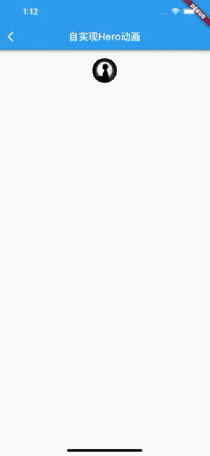

# 9.4 Hero动画

## 9.4.1 自实现Hero动画

比如现在有一个头像组件，初始的时候是一个圆形的小图，我们想实现点击后查看大图的功能，为了有较好的体验，小图变成大图和大图变回小图时我们分别执行一个“飞行”过渡动画，效果如图9-2所示：



要实现上面的动画效果，最简单的方式就是使用 Flutter 的 Hero 动画，但是为了让读者理解 Hero 动画原理，我先不使用Hero 动画，而是通过之前章节所学的知识来实现一下这个效果。

简单分析后有一个思路：首先我们先确定小图和大图的位置和大小，动画的话用一个Stack，然后通过 Positioned 来设置每一帧的组件位置和大小，实现如下：

```dart

class CustomHeroAnimation extends StatefulWidget {
  const CustomHeroAnimation({Key? key}) : super(key: key);

  @override
  _CustomHeroAnimationState createState() => _CustomHeroAnimationState();
}

class _CustomHeroAnimationState extends State<CustomHeroAnimation>
    with SingleTickerProviderStateMixin {
  late AnimationController _controller;

  bool _animating = false;
  AnimationStatus? _lastAnimationStatus;
  late Animation _animation;

  //两个组件在Stack中所占的区域
  Rect? child1Rect;
  Rect? child2Rect;

  @override
  void initState() {
    _controller =
        AnimationController(vsync: this, duration: Duration(milliseconds: 200));
    //应用curve
    _animation = CurvedAnimation(
      parent: _controller,
      curve: Curves.easeIn,
    );

    _controller.addListener(() {
      if (_controller.isCompleted || _controller.isDismissed) {
        if (_animating) {
          setState(() {
            _animating = false;
          });
        }
      } else {
        _lastAnimationStatus = _controller.status;
      }
    });
    super.initState();
  }

  @override
  void dispose() {
    _controller.dispose();
    super.dispose();
  }

  @override
  Widget build(BuildContext context) {
    //小头像
    final Widget child1 = wChild1();
    //大头像
    final Widget child2 = wChild2();

    //是否展示小头像；只有在动画执行时、初始状态或者刚从大图变为小图时才应该显示小头像
    bool showChild1 =
        !_animating && _lastAnimationStatus != AnimationStatus.forward;

    // 执行动画时的目标组件；如果是从小图变为大图，则目标组件是大图；反之则是小图
    Widget targetWidget;
    if (showChild1 || _controller.status == AnimationStatus.reverse) {
      targetWidget = child1;
    } else {
      targetWidget = child2;
    }

    return LayoutBuilder(builder: (context, constraints) {
      return SizedBox(
        //我们让Stack 填满屏幕剩余空间
        width: constraints.maxWidth,
        height: constraints.maxHeight,
        child: Stack(
          alignment: AlignmentDirectional.topCenter,
          children: [
            if (showChild1)
              AfterLayout( 
                //获取小图在Stack中占用的Rect信息
                callback: (value) => child1Rect = _getRect(value),
                child: child1,
              ),
            if (!showChild1)
              AnimatedBuilder(
                animation: _animation,
                builder: (context, child) {
                  //求出 rect 插值
                  final rect = Rect.lerp(
                    child1Rect,
                    child2Rect,
                    _animation.value,
                  );
                  // 通过 Positioned 设置组件大小和位置
                  return Positioned.fromRect(rect: rect!, child: child!);
                },
                child: targetWidget,
              ),
            // 用于测量 child2 的大小，设置为全透明并且不能响应事件
            IgnorePointer(
              child: Center(
                child: Opacity(
                  opacity: 0,
                  child: AfterLayout(
                    //获取大图在Stack中占用的Rect信息
                    callback: (value) => child2Rect = _getRect(value),
                    child: child2,
                  ),
                ),
              ),
            ),
          ],
        ),
      );
    });
  }

  Widget wChild1() {
    //点击后执行正向动画
    return GestureDetector(
      onTap: () {
        setState(() {
          _animating = true;
          _controller.forward();
        });
      },
      child: SizedBox(
        width: 50,
        child: ClipOval(child: Image.asset("imgs/avatar.png")),
      ),
    );
  }

  Widget wChild2() {
    // 点击后执行反向动画
    return GestureDetector(
      onTap: () {
        setState(() {
          _animating = true;
          _controller.reverse();
        });
      },
      child: Image.asset("imgs/avatar.png", width: 400),
    );
  }

  Rect _getRect(RenderAfterLayout renderAfterLayout) {
    //我们需要获取的是AfterLayout子组件相对于Stack的Rect
    return renderAfterLayout.localToGlobal(
          Offset.zero,
          //找到Stack对应的 RenderObject 对象
          ancestor: context.findRenderObject(),
        ) &
        renderAfterLayout.size;
  }
}
```

运行后点击头像就可以实现上图中的动画效果，注意，我们是通过自定义的 AfterLayout 组件来获取组件的 Rect 信息的，该组件在第四章介绍过，我们将在14.4节中详细介绍该组件原理。

可以看到，整个飞行动画的实现还是比较复杂的，但由于这种飞行动画在交互上会经常被用到，因此 Flutter 在框架层抽象了上述实现飞行动画的逻辑，提供了一种通用且简单的实现 Hero 动画的方式。

## 9.4.2 Flutter Hero动画

Hero 指的是可以在路由(页面)之间“飞行”的 widget，简单来说 Hero 动画就是在路由切换时，有一个共享的widget 可以在新旧路由间切换。由于共享的 widget 在新旧路由页面上的位置、外观可能有所差异，所以在路由切换时会从旧路逐渐过渡到新路由中的指定位置，这样就会产生一个 Hero 动画。

你可能多次看到过 hero 动画。例如，一个路由中显示待售商品的缩略图列表，选择一个条目会将其跳转到一个新路由，新路由中包含该商品的详细信息和“购买”按钮。 在Flutter中将图片从一个路由“飞”到另一个路由称为**hero动画**，尽管相同的动作有时也称为 **共享元素转换**。下面我们通过一个示例来体验一下 hero 动画。

> 为什么要将这种可飞行的共享组件称为hero（英雄），有一种说法是说美国文化中的超人是可以飞的，那是美国人心中的大英雄，还有漫威中的超级英雄基本上都是会飞的，所以Flutter开发人员就对这种“会飞的widget”就起了一个富有浪漫主义的名字hero。当然这种说法并非官方解释，但却很有意思。

#### 示例

假设有两个路由A和B，他们的内容交互如下：

A：包含一个用户头像，圆形，点击后跳到B路由，可以查看大图。

B：显示用户头像原图，矩形。

在AB两个路由之间跳转的时候，用户头像会逐渐过渡到目标路由页的头像上，接下来我们先看看代码，然后再解析。

路由A：

```dart
class HeroAnimationRouteA extends StatelessWidget {
  const HeroAnimationRouteA({Key? key}) : super(key: key);

  @override
  Widget build(BuildContext context) {
    return Container(
      alignment: Alignment.topCenter,
      child: Column(
        children: <Widget>[
          InkWell(
            child: Hero(
              tag: "avatar", //唯一标记，前后两个路由页Hero的tag必须相同
              child: ClipOval(
                child: Image.asset(
                  "imgs/avatar.png",
                  width: 50.0,
                ),
              ),
            ),
            onTap: () {
              //打开B路由
              Navigator.push(context, PageRouteBuilder(
                pageBuilder: (
                  BuildContext context,
                  animation,
                  secondaryAnimation,
                ) {
                  return FadeTransition(
                    opacity: animation,
                    child: Scaffold(
                      appBar: AppBar(
                        title: const Text("原图"),
                      ),
                      body: const HeroAnimationRouteB(),
                    ),
                  );
                },
              ));
            },
          ),
          const Padding(
            padding: EdgeInsets.only(top: 8.0),
            child: Text("点击头像"),
          )
        ],
      ),
    );
  }
}
```

路由B：

```dart
class HeroAnimationRouteB extends StatelessWidget {
  @override
  Widget build(BuildContext context) {
    return Center(
      child: Hero(
        tag: "avatar", //唯一标记，前后两个路由页Hero的tag必须相同
        child: Image.asset("imgs/avatar.png"),
      ),
    );
  }
}
```

我们可以看到，实现 Hero 动画只需要用`Hero`组件将要共享的 widget 包装起来，并提供一个相同的 tag 即可，中间的过渡帧都是 Flutter 框架自动完成的。必须要注意， 前后路由页的共享`Hero`的 tag 必须是相同的，Flutter 框架内部正是通过 tag 来确定新旧路由页widget的对应关系的。

Hero 动画的原理比较简单，Flutter 框架知道新旧路由页中共享元素的位置和大小，所以根据这两个端点，在动画执行过程中求出过渡时的插值（中间态）即可，而感到幸运的是，这些事情不需要我们自己动手，Flutter 已经帮我们做了，实际上，Flutter Hero 动画的实现原理和我们在本章开始自实现的原理是差不多的，读者有兴趣可以去看 Hero 动画相关的源码。


