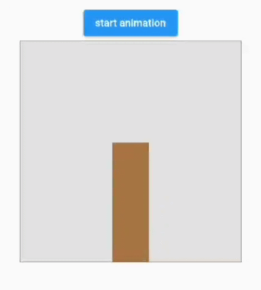

# 9.5 交织动画

## 9.5.1 简介

有些时候我们可能会需要一些复杂的动画，这些动画可能由一个动画序列或重叠的动画组成，比如：有一个柱状图，需要在高度增长的同时改变颜色，等到增长到最大高度后，我们需要在X轴上平移一段距离。可以发现上述场景在不同阶段包含了多种动画，要实现这种效果，使用交织动画（Stagger Animation）会非常简单。交织动画需要注意以下几点：

1. 要创建交织动画，需要使用多个动画对象（`Animation`）。
2. 一个`AnimationController`控制所有的动画对象。
3. 给每一个动画对象指定时间间隔（Interval）

所有动画都由同一个[AnimationController](https://docs.flutter.io/flutter/animation/AnimationController-class.html)驱动，无论动画需要持续多长时间，控制器的值必须在0.0到1.0之间，而每个动画的间隔（Interval）也必须介于0.0和1.0之间。对于在间隔中设置动画的每个属性，需要分别创建一个[Tween](https://docs.flutter.io/flutter/animation/Tween-class.html) 用于指定该属性的开始值和结束值。也就是说0.0到1.0代表整个动画过程，我们可以给不同动画指定不同的起始点和终止点来决定它们的开始时间和终止时间。

## 9.5.2 示例

下面我们看一个例子，实现一个柱状图增长的动画：

1. 开始时高度从0增长到300像素，同时颜色由绿色渐变为红色；这个过程占据整个动画时间的60%。
2. 高度增长到300后，开始沿X轴向右平移100像素；这个过程占用整个动画时间的40%。

我们将执行动画的Widget分离出来：

```dart
class StaggerAnimation extends StatelessWidget {
  StaggerAnimation({
    Key? key,
    required this.controller,
  }) : super(key: key) {
    //高度动画
    height = Tween<double>(
      begin: .0,
      end: 300.0,
    ).animate(
      CurvedAnimation(
        parent: controller,
        curve: const Interval(
          0.0, 0.6, //间隔，前60%的动画时间
          curve: Curves.ease,
        ),
      ),
    );

    color = ColorTween(
      begin: Colors.green,
      end: Colors.red,
    ).animate(
      CurvedAnimation(
        parent: controller,
        curve: const Interval(
          0.0, 0.6, //间隔，前60%的动画时间
          curve: Curves.ease,
        ),
      ),
    );

    padding = Tween<EdgeInsets>(
      begin: const EdgeInsets.only(left: .0),
      end: const EdgeInsets.only(left: 100.0),
    ).animate(
      CurvedAnimation(
        parent: controller,
        curve: const Interval(
          0.6, 1.0, //间隔，后40%的动画时间
          curve: Curves.ease,
        ),
      ),
    );
  }

  late final Animation<double> controller;
  late final Animation<double> height;
  late final Animation<EdgeInsets> padding;
  late final Animation<Color?> color;

  Widget _buildAnimation(BuildContext context, child) {
    return Container(
      alignment: Alignment.bottomCenter,
      padding: padding.value,
      child: Container(
        color: color.value,
        width: 50.0,
        height: height.value,
      ),
    );
  }

  @override
  Widget build(BuildContext context) {
    return AnimatedBuilder(
      builder: _buildAnimation,
      animation: controller,
    );
  }
}
```

`StaggerAnimation`中定义了三个动画，分别是对`Container`的`height`、`color`、`padding`属性设置的动画，然后通过`Interval`来为每个动画指定在整个动画过程中的起始点和终点。下面我们来实现启动动画的路由：

```dart
class StaggerRoute extends StatefulWidget {
  @override
  _StaggerRouteState createState() => _StaggerRouteState();
}

class _StaggerRouteState extends State<StaggerRoute>
    with TickerProviderStateMixin {
  late AnimationController _controller;

  @override
  void initState() {
    super.initState();

    _controller = AnimationController(
      duration: const Duration(milliseconds: 2000),
      vsync: this,
    );
  }

  _playAnimation() async {
    try {
      //先正向执行动画
      await _controller.forward().orCancel;
      //再反向执行动画
      await _controller.reverse().orCancel;
    } on TickerCanceled {
      //捕获异常。可能发生在组件销毁时，计时器会被取消。
    }
  }

  @override
  Widget build(BuildContext context) {
    return Center(
      child: Column(
        children: [
          ElevatedButton(
            onPressed: () => _playAnimation(),
            child: Text("start animation"),
          ),
          Container(
            width: 300.0,
            height: 300.0,
            decoration: BoxDecoration(
              color: Colors.black.withOpacity(0.1),
              border: Border.all(
                color: Colors.black.withOpacity(0.5),
              ),
            ),
            //调用我们定义的交错动画Widget
            child: StaggerAnimation(controller: _controller),
          ),
        ],
      ),
    );
  }
}
```
执行效果如图9-3所示：



